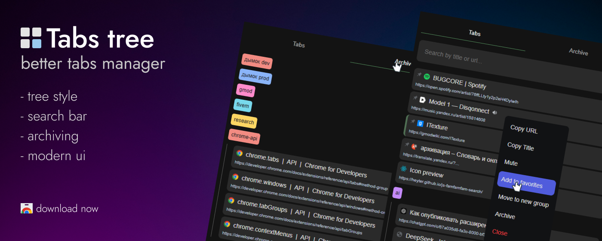

# Tabs tree

Tree style tabs manager designed to enhance **Quality of Life**.  
Manage, navigate, and search tabs with an intuitive and aesthetic UI.  
Essential for anyone managing numerous tabs and tab groups.

Killer-feature: "**Archive**"  
If you're overwhelmed by too many tabs, the "Archive Group" & "Archive Tab" features allows you to temporarily remove it from tab bar while saving its contents for later access.

## Usage

1. Click "alt+q" to open popup (you can change it in `manifest.json` - `_execute_action`)
2. See tree style tabs popup with perfect navigation
3. Use fuzzy searchbar
4. Click on tab or tab-group for quick actions

## Installation

1. Clone or [download](https://github.com/Be1zebub/Chrome-Tabs-tree/archive/refs/heads/master.zip) repository
2. Goto [chrome://extensions/](chrome://extensions/)
3. Click "Load unpacked" in header section
4. Select repo directory
5. Have fun

## Other browsers?

It should works fine on any **chromium** based browser (chrome, edge, brave, opera, e.t.c)  
Port to other browsers like firefox not planned.  
But feel free to **fork**/**pr**.

## Todo

1. fix favicon display for localhost tabs (not sure if this possible)
2. display loading circle while tab loading
3. rewrite in svelte
4. dragging (sort/move between groups)
5. sync (listen chrome-api events)
6. archive ui searchbar
